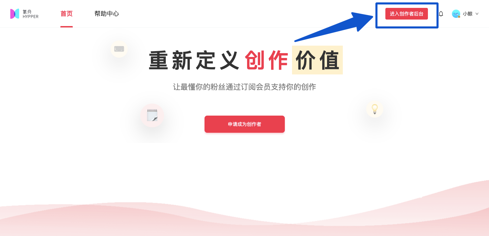
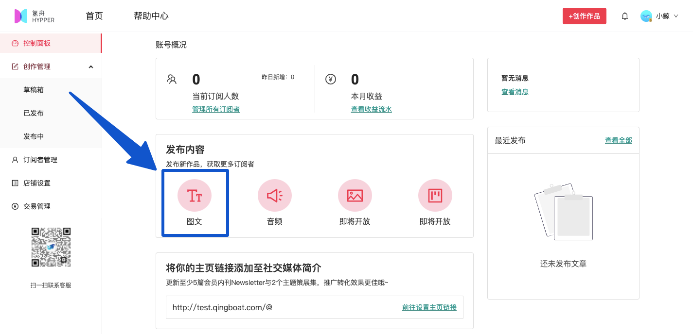
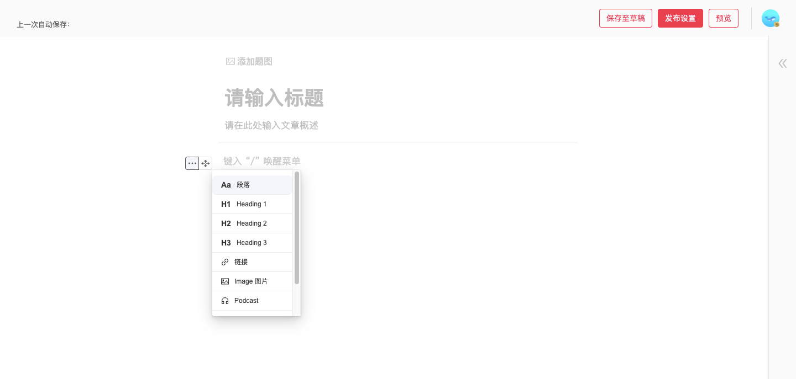
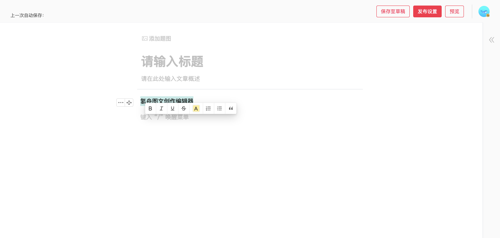
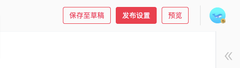
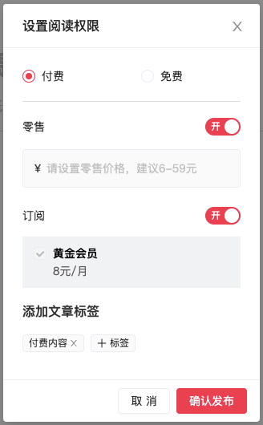

# ✍ 图文发布

### 1. 进入图文编辑器

氢舟首页右上角点击【进入创作者后台】。

进入创作者后台，在控制面板-发布内容-点击【图文】，即可进入编辑器；

或点击页面右上角【创作作品】-选择发布类型【图文】。

（注：打开编辑器时，默认打开新标签页，部分浏览器会组织窗口弹出，请手动点击允许弹出）

### 2. 使用编辑器创作

编辑器支持上传题图、输入文章概述，正文可插入链接、图片、音频（Podcast）、网页卡片等，支持更加灵活地创作。

选中文本，即可加粗、设置斜体、下划线，调整颜色和对齐等。

### 3. 设置权限并发布

创作完毕后，点击页面右上角的三个按钮，分别可以【保存至草稿】、进入【发布设置】，或在新标签页中预览\~

点击【发布设置】后，请在弹出窗口中设置阅读权限、添加文章标签，确认无误后，点击【确认发布】等待审核。

审核通过后，这篇文章将会显示在您的氢舟个人主页上，已关注氢舟hypper服务号的订阅用户将会收到一条更新提示，邀请他们来阅读这篇作品\~

创建过程中遇到的问题，可在创作者后台微信扫描小鲸二维码，或创作者运营支持【氢舟小鲸🐳 】的微信“pathway2020”咨询。
