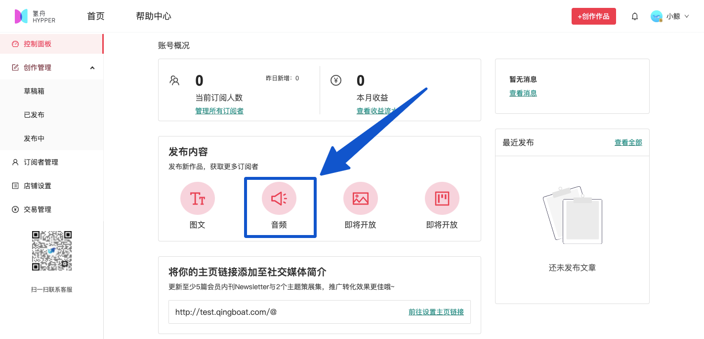
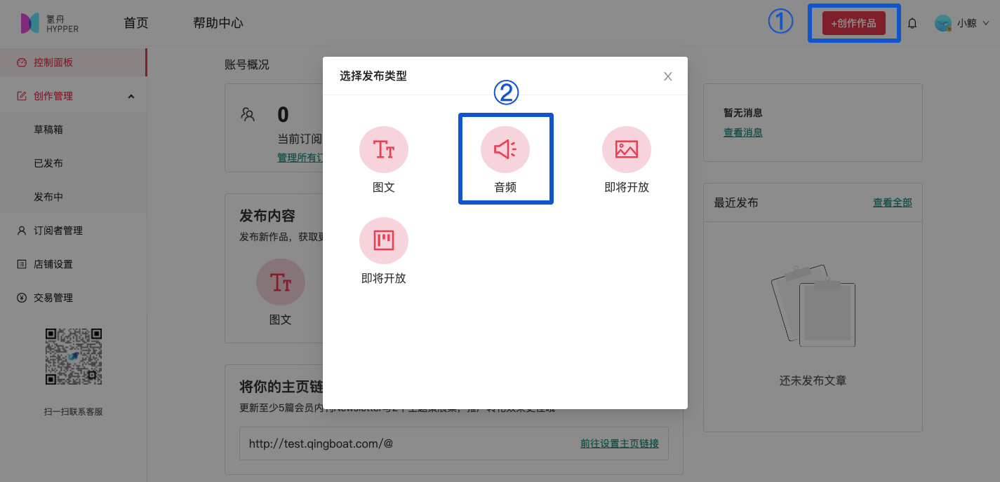
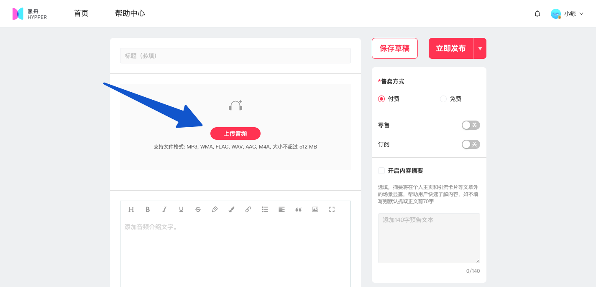
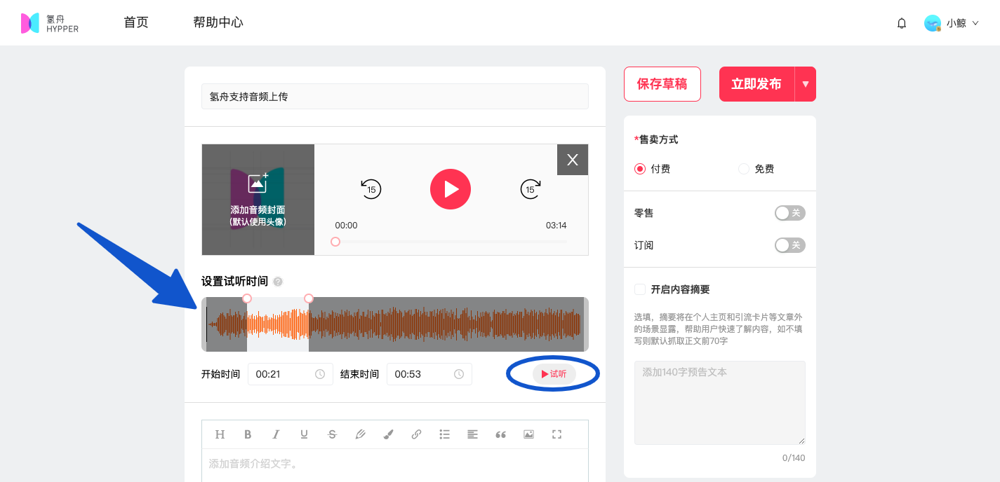
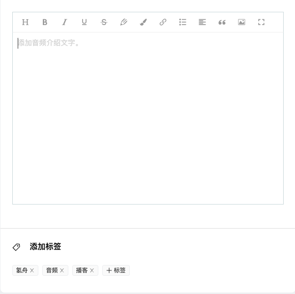
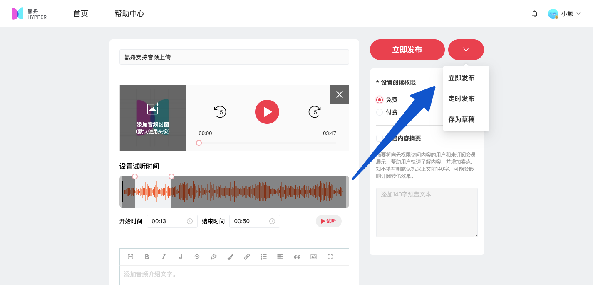
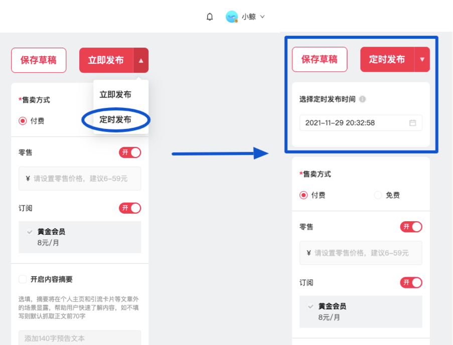
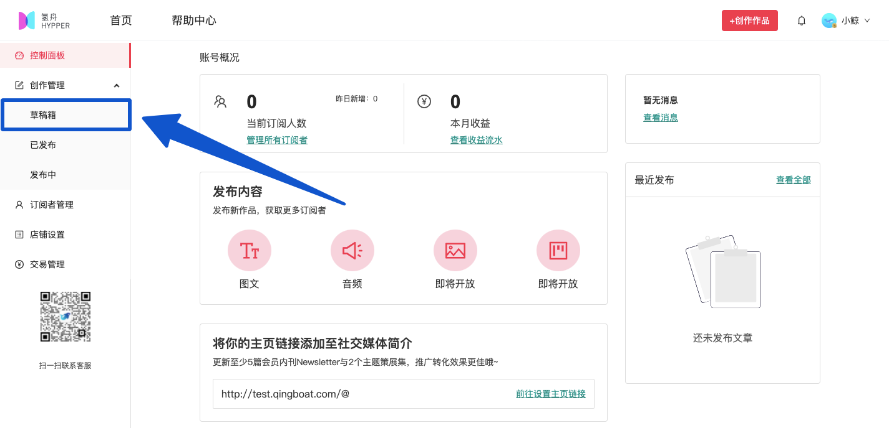

# 🎶 音频发布

### 1. 进入音频发布页面

在创作者后台的「控制面板」——选择「发布内容」——点击「音频」。

或在后台任一页面，点击右上角红色按钮「创作作品」——点击发布「音频」。

注：点击后默认创建“新标签页”，如Safari等浏览器可能“拦截窗口弹出”，导致无法正常打开编辑页面，需手动点击允许弹出。

### **2. 音频文件上传&编辑**

点击按钮上传本地音频文件，目前支持6种主流音频文件格式（MP3, WMA, FLAC, WAV, AAC, M4A），文件**大小不超过512MB**。

音频文件上传后，系统会自动解析并生成<mark style="color:red;">**可自由拖动的音轨**</mark>，用以设置【试听时间】；

也可以点击数字展开下拉菜单，分别设置【开始时间】和【结束时间】，起止时间点都设好后，记得**点击「确定」按钮保存**\~

最后，请点击右侧【试听】按钮，可播放试听片段，以确保设置无误。

此外，氢舟还支持「添加音频介绍文字」、「添加标签」、「开启内容摘要」，各位创作者可以根据自己的需求增加以上内容\~

### **3. 设置权限&发布**

编辑完成后，请先在页面右侧设置阅读权限，随后可根据自己的需求，选择「立即发布」、「定时发布」或「存为草稿」。

已经存为草稿的内容，可在「创作者管理」-「草稿箱」这里找到\~

**更多类型作品上传功能开发中，敬请期待……**
