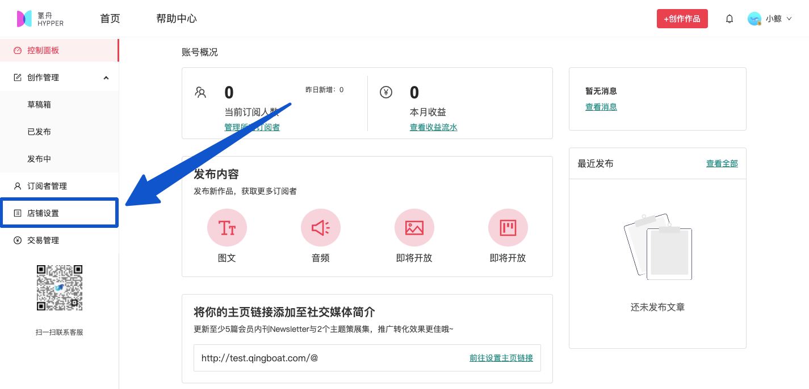
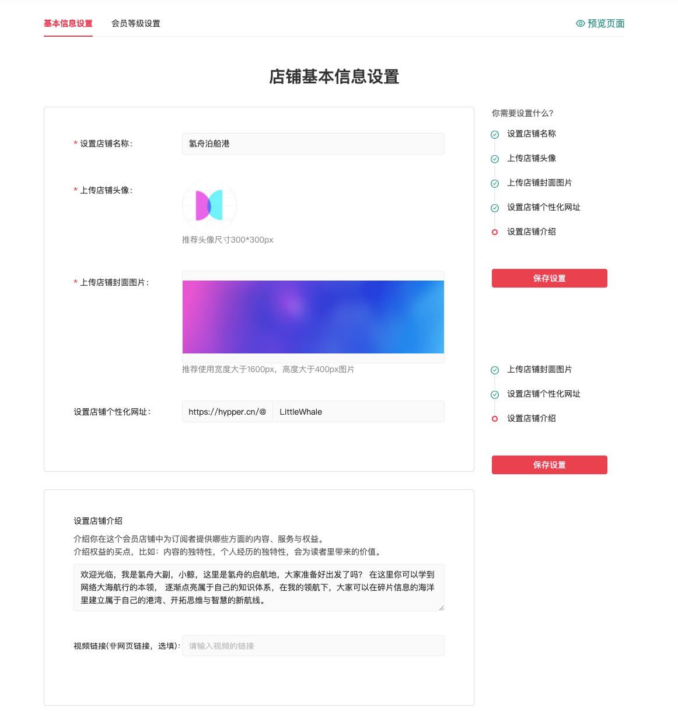

# 🏠 店铺设置

### 装修你的个人店铺

#### 1. 进入创作者后台

在网站右上角菜单点击“进入创作者后台”一栏

#### 2. 进入店铺设置页

在页面左侧菜单点击【店铺设置】

#### 3. 设置店铺信息

填写店铺名称、个性地址、店铺介绍等内容，并上传店铺头像、店铺背景图

完成设置后，点击右上方“预览页面”可查看效果，点击右侧“保存设置”即可保存，信息会在网站个人店铺页面展示出来。

