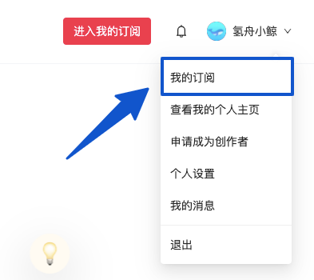
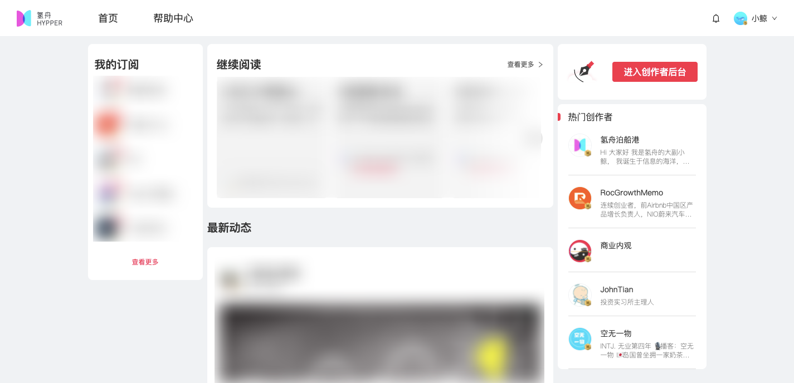
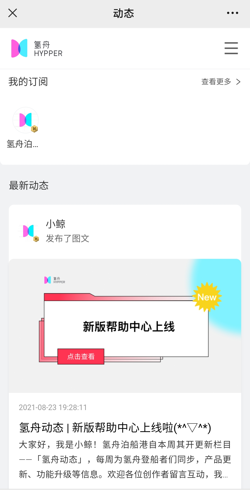

# 📖 如何查看已订阅

### 网页端

进入氢舟官网首页，点击右上角下拉菜单，即可找到【我的订阅】

进入【我的订阅】详情页后，可在此页面查看“我的订阅”、“继续阅读未看完的作品”、订阅作者的“最新动态”等。如果已注册成为创作者，还可以点击右上角红色按钮快捷进入创作者后台\~

### 手机端

打开【氢舟Hypper】公众号，点击菜单栏【会员内刊】，进入我的订阅页面。

进入后可查看“我订阅的创作者”，下拉页面可看到所有订阅创作者的“最新动态”。

