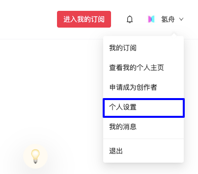
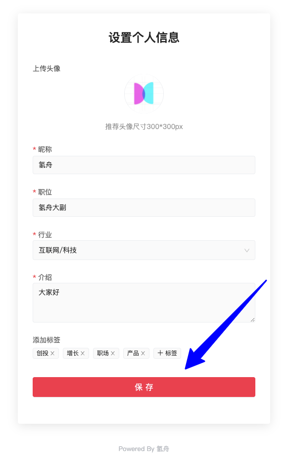
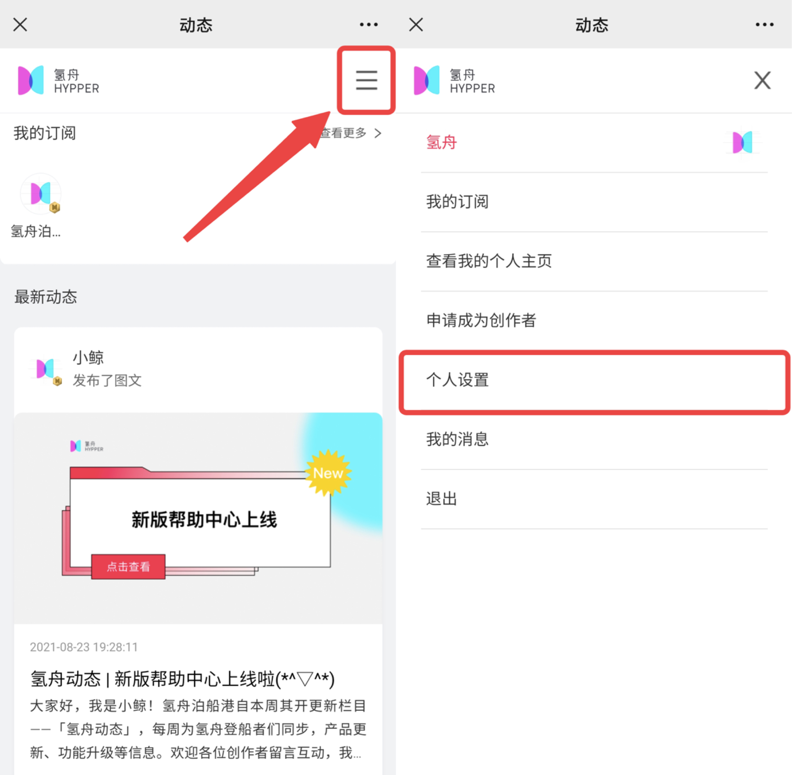
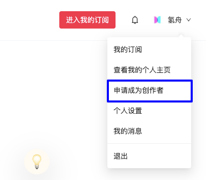
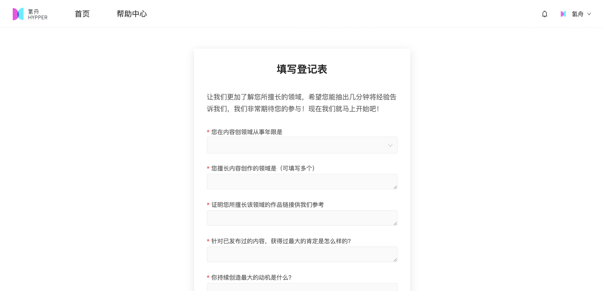
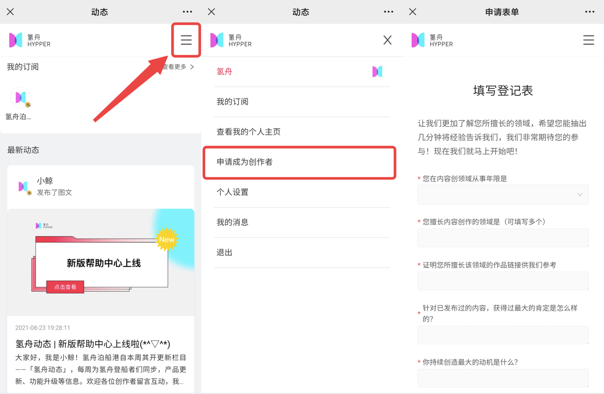

# 🔐 账号相关

## 修改个人设置

### 网页端

点击右上角下拉菜单，可进入【个人设置】页面。

修改完成后，请点击保存，更新后的个人介绍体现在你的【个人主页】上。

### 手机端

点击公众号菜单栏【会员内刊】进入我的订阅页面。点击右上角展开菜单，即可找到【个人设置】修改入口。

## 申请成为创作者

如果你在注册时选择了【成为一个订阅用户】，但在后续使用过程中，想要申请成为创作者，展现你的才华，我们也非常欢迎👏🏻 \~

### 网页端

点击首页右上角菜单，即可找到【申请成为创作者】

填写登记表并提交后，工作人员将在2个工作日内为你审核完成。

### 手机端

点击公众号菜单栏【会员内刊】进入我的订阅页面。点击右上角展开菜单，即可找到【申请成为创作者】修改入口。

如您在使用过程中遇到其他问题，或有一些对氢舟的建议\~

#### 欢迎添加订阅用户专属客服——氢舟客服小鸥（**微信号：hypper2021）**

或扫描下图二维码快速添加\~

