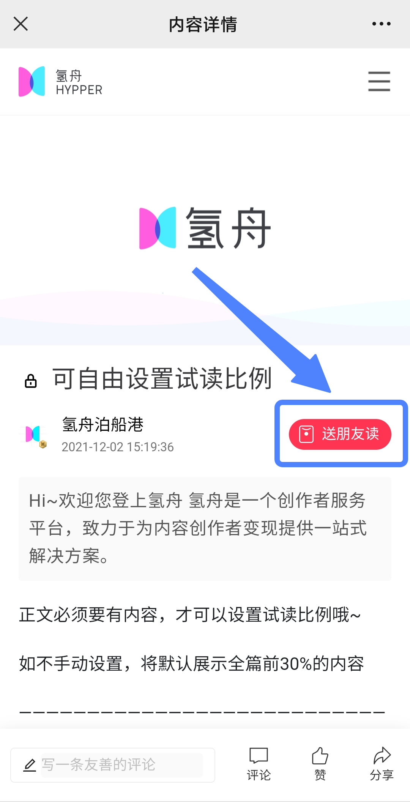
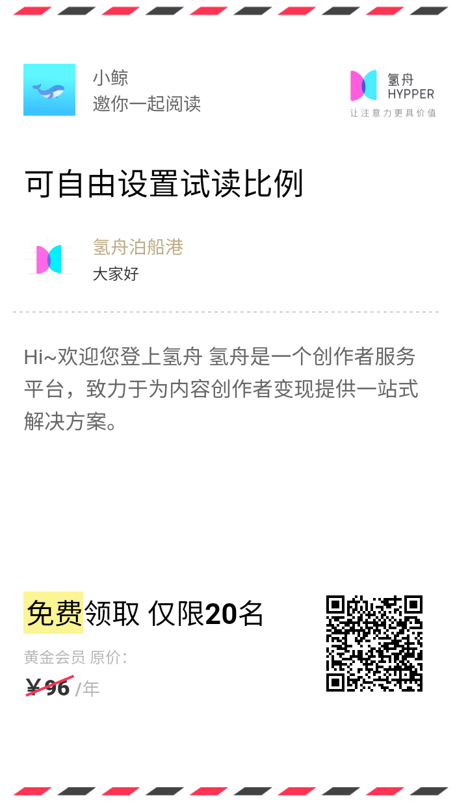
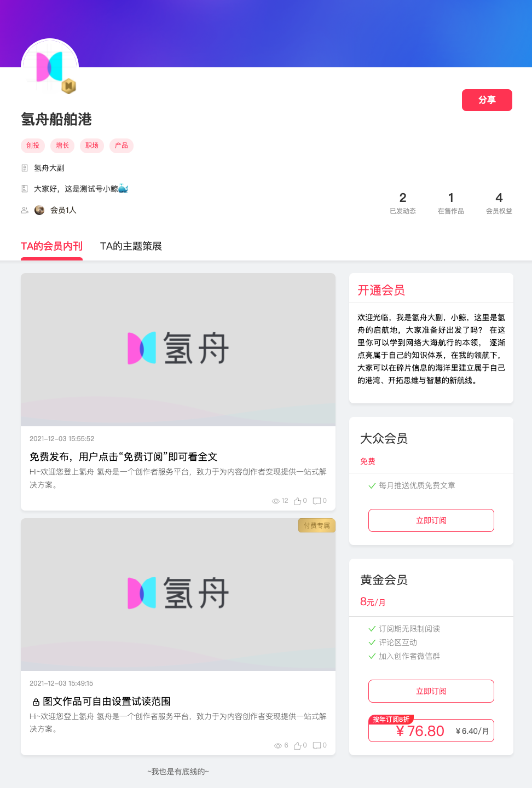

# 📤 送朋友读

发布付费作品后（包含“订阅”和“零售），创作者可在个人主页里，点击卡片进入作品详情页。

点击右上角红色按钮【送朋友读】，即可自动生成分享卡片。

长按保存分享卡，将其转发到社交媒体、朋友圈、粉丝群等，前20名扫码的用户可免费领取，解锁该篇文章的完整内容。

不仅是创作者本人，你的付费会员、购买零售作品的粉丝，都可以使用【送朋友读】功能。

欢迎在作品的最后，鼓励你的粉丝们多多分享，让你的优质内容被更多人看见吧\~
