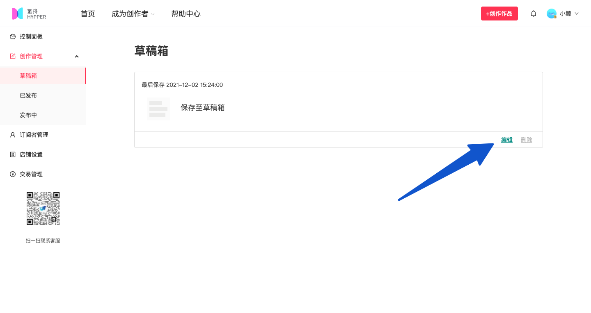

# ⏱ 保存草稿/定时发布

### 保存草稿

请在后台【创作管理】中点击【草稿箱】查看已经存为草稿的内容。可继续编辑，或删除。

### 定时发布

点击箭头展开菜单，即可切换为【定时发布】，仅可设置5分钟及以后的时间点。

.jpg>)

点击红色按钮【定时发布】，内容将进入审核状态，审核通过后，可在**【发布中】**找到该篇内容。

如需修改内容或发布时间，请先点击撤回，将该篇内容撤回到草稿箱再编辑。

.png>)

若审核未通过，该篇内容将被退回到【草稿箱】，并显示审核失败原因。
